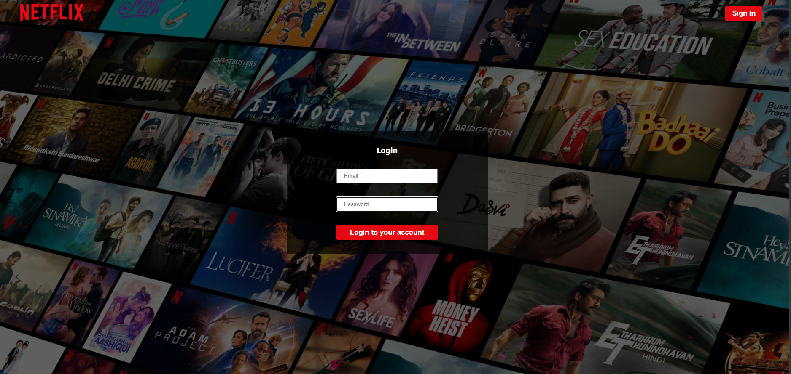
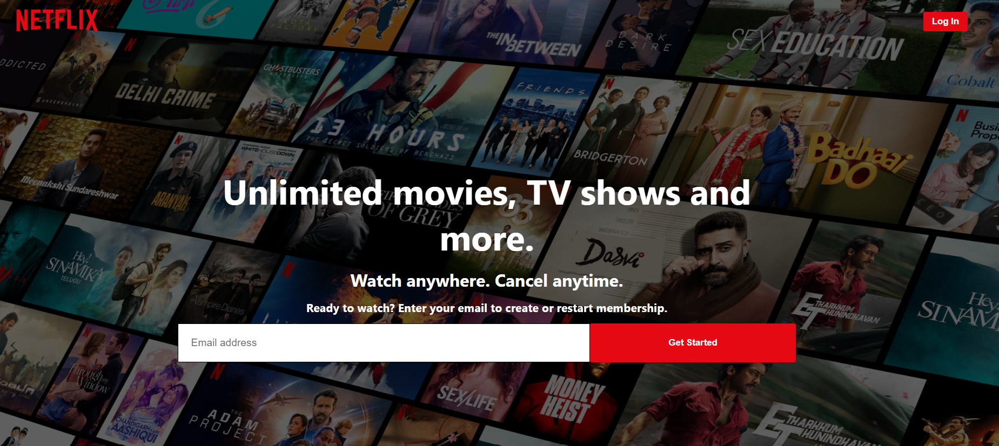
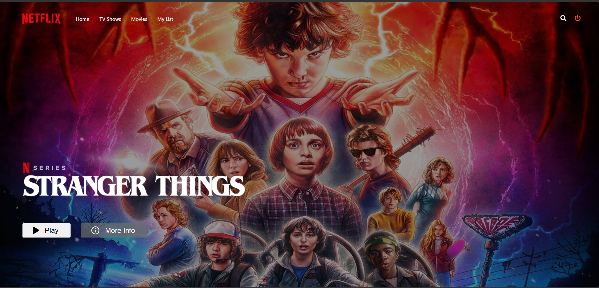
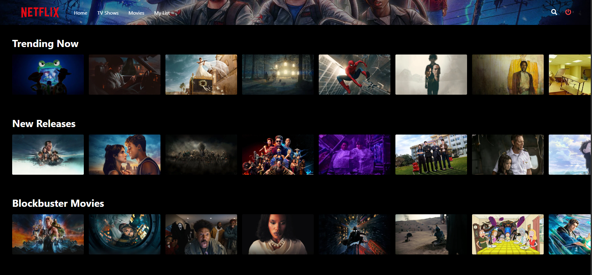

# 🎬 Netflix Clone

A full-stack Netflix-inspired web application built using React, Node.js, Express, MongoDB, and Firebase Authentication.

## 🚀 Features

* User Registration
* User Login Authentication
* Firebase Authentication
* Netflix-inspired UI
* Responsive Design
* MongoDB Integration
* Express REST APIs
* React Frontend

---

## 🛠️ Tech Stack

### Frontend

* React.js
* CSS3
* JavaScript

### Backend

* Node.js
* Express.js

### Database

* MongoDB
* Mongoose

### Authentication

* Firebase Authentication

---

## 📁 Project Structure

```text
Netflix-clone
│
├── netflix-api
│   ├── controllers
│   ├── models
│   ├── routes
│   └── server.js
│
├── netflix-ui
│   ├── public
│   ├── src
│   └── package.json
│
└── README.md
```

---

## 📸 Screenshots

### Login Page



### Registration Page



### Home Page



### Movie Details



---

## ⚙️ Installation

### Clone Repository

```bash
git clone https://github.com/your-username/netflix-clone.git
cd netflix-clone
```

### Install Backend Dependencies

```bash
cd netflix-api
npm install
```

### Install Frontend Dependencies

```bash
cd ../netflix-ui
npm install
```

---

## 🗄️ MongoDB Setup

Ensure MongoDB is installed and running.

```javascript
mongodb://localhost:27017/netflix
```

---

## 🔥 Firebase Setup

1. Create a Firebase Project.
2. Enable Email/Password Authentication.
3. Copy Firebase Configuration.
4. Replace the configuration inside:

```text
src/utils/firebase-config.js
```

---

## ▶️ Run the Project

### Backend

```bash
cd netflix-api
npm start
```

Runs on:

```text
http://localhost:5000
```

### Frontend

```bash
cd netflix-ui
npm start
```

Runs on:

```text
http://localhost:3000
```

---

## 🌐 Deployment

### Frontend

* Vercel
* Netlify

### Backend

* Render
* Railway

### Database

* MongoDB Atlas

---

## 🔮 Future Enhancements

* Movie Streaming Support
* Watchlist Feature
* Search Movies
* Categories
* User Profiles
* Admin Dashboard
* JWT Authentication

---

## 👨‍💻 Author

**Kaivalya**

Final Year Student | MERN Stack Developer

---

## 📄 License

This project is for educational and portfolio purposes.
